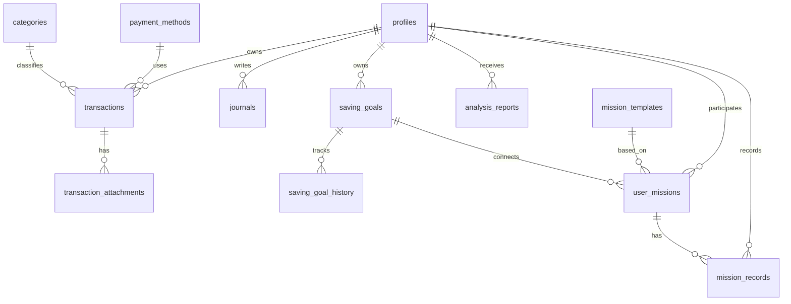

# MO:UM (모음)

> 소비 기록과 저축 목표 관리를 통해 건강한 금융 습관을 만들 수 있도록 도와주는 개인 맞춤형 자산 관리 웹 서비스입니다.

## 🔗 프로젝트 링크

- GitHub: https://github.com/tsoyirina48-ai/est_13_final_project
- 배포 사이트: https://est-13-final-project.vercel.app/

## 📌 프로젝트 소개

MO:UM(모음)은 소비 기록과 저축 목표 관리를 통해 사용자가 건강한 금융 습관을 만들 수 있도록 돕는 개인 맞춤형 자산 관리 웹 서비스입니다.

사용자는 수입과 지출을 기록하고 소비 패턴을 분석하며, 저축 목표와 챌린지를 관리할 수 있습니다. 또한 AI 기반 분석 리포트와 맞춤형 미션을 통해 자신의 소비 습관을 이해하고 꾸준한 절약을 실천할 수 있습니다.

- 프로젝트 기간: 2026.07.15 ~ 2026.08.21
- 팀 구성: 프론트엔드 개발자 5명

## 🗓️ 프로젝트 일정

| 날짜       | 일정        |
| ---------- | ----------- |
| 2026.07.15 | 팀 구성     |
| 2026.07.24 | 기획 발표   |
| 2026.07.31 | 디자인 발표 |
| 2026.08.19 | 리허설      |
| 2026.08.21 | 최종 발표   |

## ✨ 주요 기능

### 🔐 회원 및 인증 관리

- 이메일 회원가입 및 로그인
- Google, Kakao 소셜 로그인
- 이메일을 통한 비밀번호 재설정
- 로그인 사용자별 프로필 및 금융 데이터 관리
- 사용자 인증 상태에 따른 페이지 접근 및 이동 처리

### 🏠 개인 맞춤형 대시보드

- 사용자 프로필 기반 맞춤형 인사 제공
- 이번 달 소비 및 저축 현황 요약
- 최근 수입·지출·이체 내역 확인
- 진행 중인 저축 목표 및 달성률 확인
- 진행 중인 챌린지와 미션 현황 확인
- 소비 기록, AI 분석, 저축 목표 정보를 한눈에 확인

### 💳 가계부 및 소비 기록

- 수입, 지출, 이체 내역 등록·조회·수정·삭제
- 단건 및 다건 소비 기록 입력
- 거래 유형별 내역 필터링
- 거래 카테고리 및 결제 수단 선택
- 출금 계좌와 입금 계좌를 지정한 계좌 이체 기록
- 날짜, 시간, 금액, 사용처 및 메모 관리
- 정기적인 수입·지출 내역 반복 설정
- 최근 거래 내역 확인 및 기존 거래 복사
- 여러 거래 내역 선택 및 관리
- 입력값 검증과 성공·오류 알림 제공

### 🧾 영수증 및 ALAN AI 자동 입력

- 영수증 이미지 업로드 및 미리보기
- JPG, PNG, WEBP 이미지 형식 지원
- 업로드된 영수증 이미지 등록·교체·삭제
- Drag & Drop 방식의 영수증 업로드
- ALAN AI를 활용한 영수증 정보 분석
- 영수증에서 금액, 날짜, 카테고리, 결제 수단 및 사용처 자동 추출
- AI 분석 결과를 소비 기록 입력 폼에 자동 반영
- 사용자가 AI 분석 결과를 확인하고 수정한 후 저장
- 사용자별 영수증 이미지를 Supabase Storage에 안전하게 저장

### 🎯 저축 목표 관리

- 새로운 저축 목표 등록
- 저축 목표 조회·수정·삭제
- 목표 이름, 목표 금액, 현재 금액 및 기간 설정
- 목표별 메모와 대표 이미지 등록
- 진행 중, 달성 완료, 중단 상태 관리
- 상태별 저축 목표 필터링
- 목표 금액 대비 현재 저축 진행률 확인
- 사용자별 저축 목표 데이터 관리

### 📊 소비 분석 및 리포트

- 총지출 및 월평균 지출 확인
- 현재 등록된 소비 카테고리 수 확인
- 설정한 예산 대비 남은 금액 확인
- 기간별 지출 추이 그래프 제공
- 카테고리별 소비 금액과 비중 확인
- 예산 대비 지출 순위 및 진행률 확인
- 최근 소비 기록을 기반으로 소비 패턴 분석
- 과도한 지출 항목과 절약 가능한 영역 확인

### 🤖 ALAN AI 맞춤형 분석

- ESTsoft에서 제공하는 ALAN AI 연동
- 사용자의 소비 데이터를 기반으로 맞춤형 소비 분석
- 주요 소비 패턴과 불필요한 지출 항목 분석
- 목표 달성 가능 시점 예측
- 사용자별 맞춤형 절약 방법 제안
- 소비 습관 개선을 위한 실천 피드백 제공
- 분석 결과를 기반으로 개인 맞춤형 미션 추천
- 소비 분석 리포트와 요약 정보 제공

### 🏆 절약 챌린지 및 미션

- ALAN AI 기반 개인 맞춤형 절약 미션 추천
- 외식 줄이기, 카페 줄이기, 배달 줄이기 등 생활형 미션 제공
- 교통비, 구독 서비스, 충동구매 및 전기 사용 절약 미션 제공
- 추천 미션 선택 및 챌린지 시작
- 요일별 미션 수행 여부와 진행 상황 확인
- 챌린지 달성 기록과 절약 금액 확인
- 출석 배지, 리워드 및 목표 달성 보상 제공
- 꾸준한 소비 습관 형성을 위한 성장 기록 관리

### 👤 마이페이지

- 사용자 닉네임, 이메일 및 가입 정보 확인
- 사용자 프로필 정보 수정
- 진행 중인 목표 및 완료한 챌린지 확인
- 이번 달 저축 금액과 지출 금액 확인
- AI 분석 이용 횟수 및 활동 통계 확인
- 평균 목표 달성률과 절약 성장률 확인
- 알림 설정 및 계정 관리

### 📱 반응형 사용자 환경

- 데스크톱, 태블릿, 모바일 반응형 화면 제공
- 화면 크기에 따른 입력 폼과 콘텐츠 배치 최적화
- 데스크톱 사이드바 및 모바일 하단 탭 메뉴 제공
- 모바일 환경에서 편리한 단건 소비 기록 입력 지원
- 공통 모달, 알림 및 확인 메시지 제공

## 🛠️ 기술 스택

### Frontend

- Next.js
- React
- JavaScript
- SCSS
- Chart.js

### Backend & Database

- Supabase
- Supabase Authentication
- Supabase Database
- Supabase Storage

### AI

- ESTsoft ALAN AI
- 소비 데이터 기반 맞춤형 분석
- 영수증 정보 분석 및 자동 입력
- 절약 미션과 금융 습관 개선 방법 추천

### Design & Collaboration

- Figma
- Git
- GitHub
- GitHub Projects

### Deployment

- Vercel

## ⚙️ 서비스 구성

| 구분              | 역할                                     |
| ----------------- | -----------------------------------------|
| Next.js           | 페이지 라우팅 및 웹 애플리케이션 구성       |
| React             | 컴포넌트 기반 UI와 상태 관리               |
| SCSS              | 공통 스타일 및 반응형 화면 구현            |
| Supabase Auth     | 이메일 및 소셜 로그인 인증                 |
| Supabase Database | 사용자, 소비 기록, 목표 데이터 저장         |
| Supabase Storage  | 영수증 및 목표 이미지 저장                 |
| ALAN AI           | 소비 분석, 영수증 인식 및 맞춤형 미션 추천  |
| Chart.js          | 소비 통계와 지출 데이터를 차트로 시각화     |
| Vercel            | 웹 서비스 배포                            |

## 🗃️ ERD



## 👥 팀원 및 역할

| 팀원     | 담당 기능                                                                                                              |
| -------- | ---------------------------------------------------------------------------------------------------------------------- |
| 권유진   | 팀장, 목표 관리·프로필 페이지, 저축 목표 생성·수정·삭제 및 진행 상태 관리, 사용자 프로필 조회·수정 UI, 반응형 레이아웃 |
| 김해나   | 메인 랜딩 페이지, 서비스 소개 섹션 및 반응형 UI 구현, ScrollSpy 기반 GNB 활성화·섹션 이동 인터랙션                     |
| 강형규   | 소비 분석·챌린지 페이지, 소비 데이터 시각화 및 AI 분석 결과 연동, 미션 추천·진행 상태 UI, Git 브랜치·PR 관리           |
| 최이리나 | 로그인·회원가입·비밀번호 재설정, Google·Kakao 로그인, Supabase Auth 연동, 반응형 인증 UI                               |
| 최윤지   | Supabase DB·RLS·RPC·Storage 및 Edge Function 구축, AI 영수증 인식 기반 소비기록 CRUD, 서브홈 데이터 통합·대시보드 구현 |

## 🖥️ 주요 화면

> 프로젝트 주요 화면은 최종 발표 후 업데이트 예정입니다.


## 🚀 실행 방법

```bash
# 저장소 복제
git clone https://github.com/hgkang2/est_13_final_project.git

# 프로젝트 폴더 이동
cd est_13_final_project

# 패키지 설치
npm install

# 개발 서버 실행
npm run dev
```

브라우저에서 `http://localhost:3000`으로 접속합니다.

> Supabase 및 ALAN AI 사용을 위해 별도의 환경 변수가 필요합니다.
